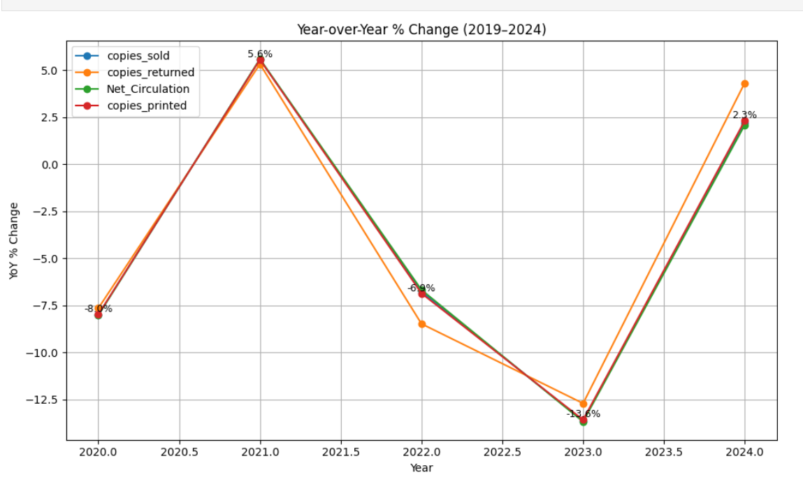
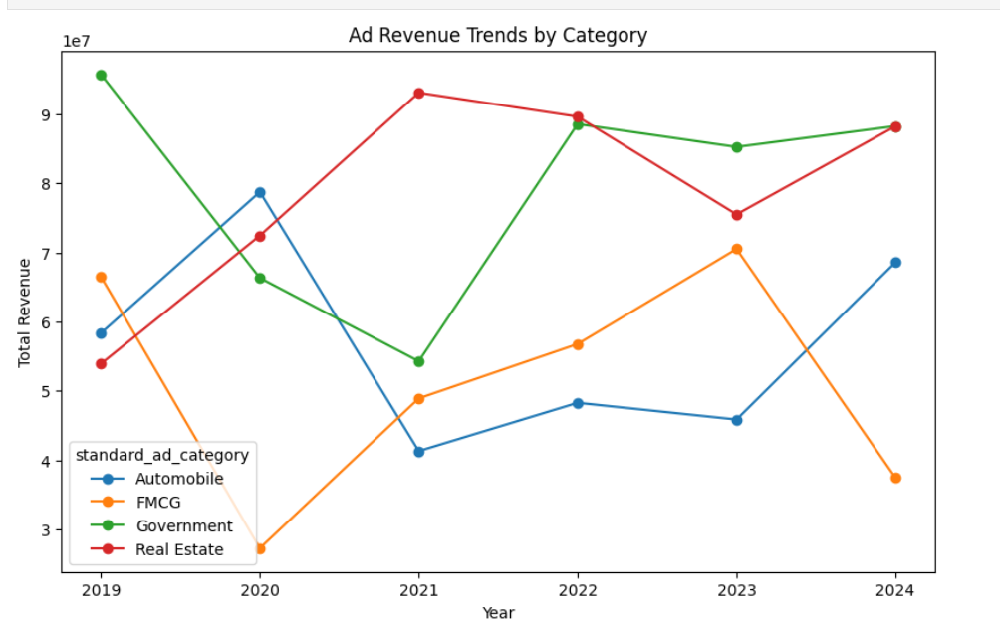
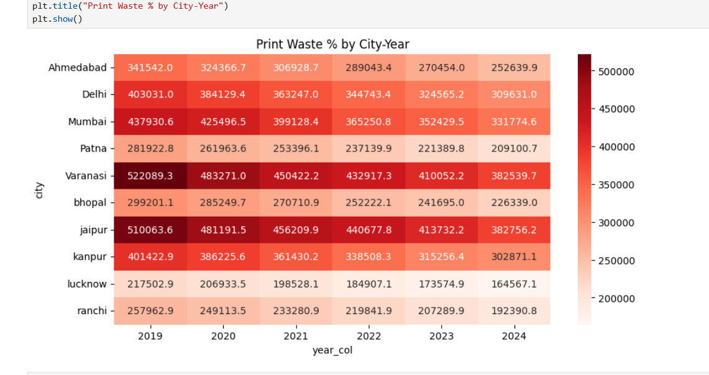
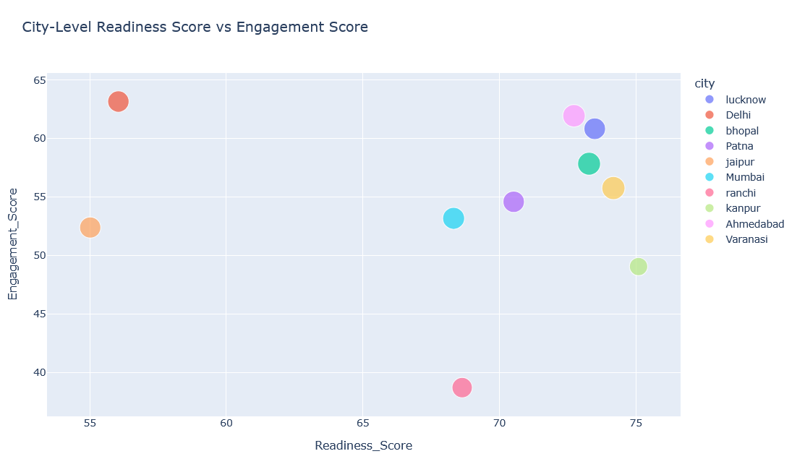
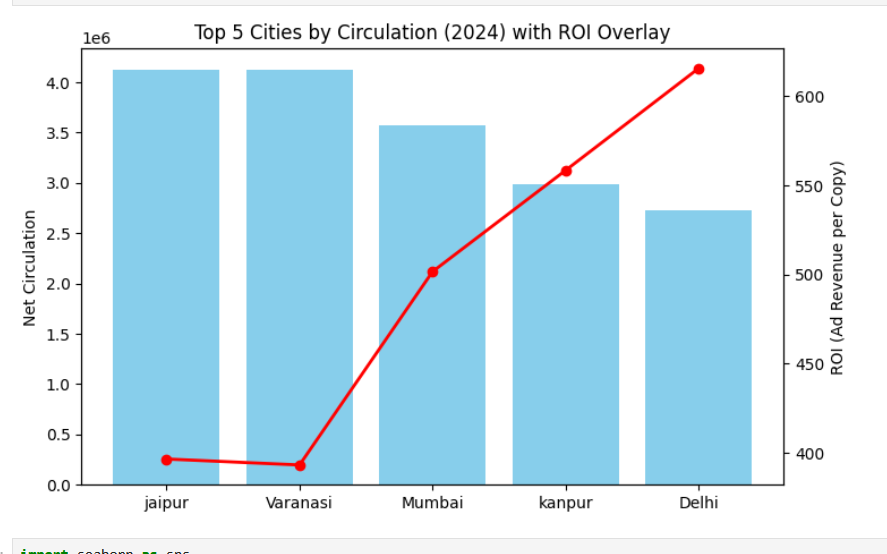

# 📰 Bharat Herald Media Analytics — SQL + Python EDA Project

**Author:** Monalika Ghosh  
**Location:** Kolkata, India  
**Email:** ghoshmonalika290@gmail.com  
**LinkedIn:** [LinkedIn Profile](https://linkedin.com/in/monalikaghosh)  

---

### 📘 Project Overview
Bharat Herald, a legacy newspaper organization, is facing steep declines in print circulation post-COVID.  
This project analyzes **operational and financial data (2019–2024)** using SQL and Python to uncover:  
- Circulation inefficiencies  
- Ad revenue concentration  
- City-wise print ROI  
- Digital readiness and engagement  

---

### 🧠 Key Insights
- **Varanasi & Delhi** show sharp MoM circulation drops — operational checks needed.  
- **Commercial Brands & Public Sector** dominate ad revenue (>70%).  
- **Ranchi, Ahmedabad, Jaipur** lead print efficiency in 2024.  
- **Kanpur** flagged as a digital readiness outlier — high readiness, low engagement.  
- **Tier-2 cities (Lucknow, Patna)** outperform metros in ad ROI.  

---

### 📊 Data Sources

| Table | Description |
|-------|--------------|
| `fact_print_sales` | Copies printed, sold, net circulation |
| `fact_ad_revenue` | Yearly ad category revenue |
| `fact_city_readiness` | Internet, literacy, smartphone rates |
| `fact_digital_pilot` | Engagement metrics |
| `dim_city` | City metadata |
| `dim_ad_category` | Ad category dimension |

---

### 🔍 Methodology
**SQL Analysis** → Extracted KPIs (MoM circulation, ad concentration, efficiency)  
**Python EDA** → Visualized trends & ROI overlay  
**Business Synthesis** → Actionable recommendations for digital relaunch  

---

### 📈 Results Summary
- Print efficiency improved 25–30% overall since 2019.  
- Ad revenue concentrated in 3 categories — diversification needed.  
- High readiness, low engagement cities = untapped potential.  
- Tier-2 markets remain most profitable in print ROI.  

---

### 🧩 Deliverables 
- 📓 `EDA_Analysis.ipynb` — Python notebook  
- 🗂️ `SQL_Queries.sql` — SQL analysis scripts  
- 📊 `Bharat_Herald_Presentation.pptx` — stakeholder presentation deck  

---

### 🚀 Recommendations
1. Introduce MoM drop alerts in SQL dashboards.  
2. Cut print runs in high-waste cities (Varanasi, Jaipur).  
3. Scale best practices from Ranchi & Patna.  
4. Pilot digital relaunch in Lucknow, Ahmedabad, and Bhopal.  

---

### 🧰 Tools & Skills Demonstrated
`SQL` · `Python (Pandas, Matplotlib)` · `Data Cleaning` · `EDA` ·  
  `Business Strategy` · `Data Storytelling`  

---

### 🧑‍💼 Author
**Monalika Ghosh**  
📍 Kolkata, India  
🔗 [LinkedIn Profile](https://linkedin.com/in/monalikaghosh)  
📧 ghoshmonalika290@gmail.com  

---

### 🖼️ Visual Samples

**1️⃣ Year-over-Year Circulation Trend (2019–2024)**

**2️⃣ Ad Revenue Trends by Category**

**3️⃣ Print Waste Analysis (2019–2024)**

**4️⃣ Readiness vs Engagement Scatter**

**5️⃣ Top 5 Cities by ROI Overlay**

---

### 🌟 Project Link
GitHub Repository: [https://github.com/monalikaghosh/bharat-herald-media-analytics](https://github.com/monalikaghosh/bharat-herald-media-analytics)
